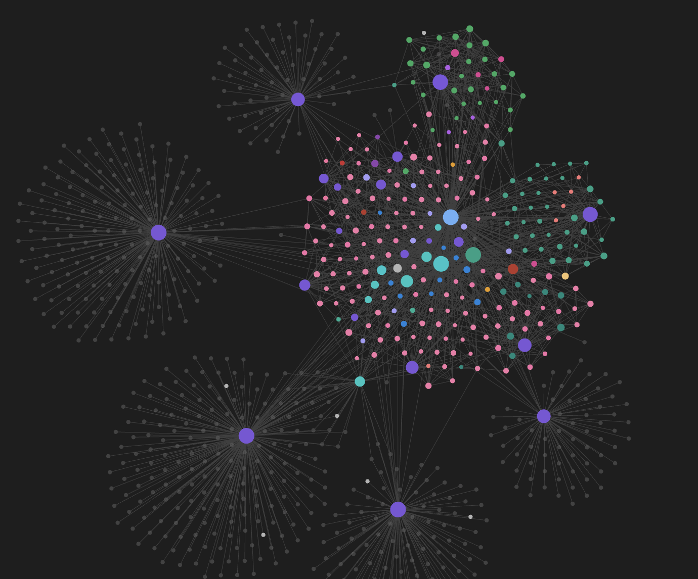
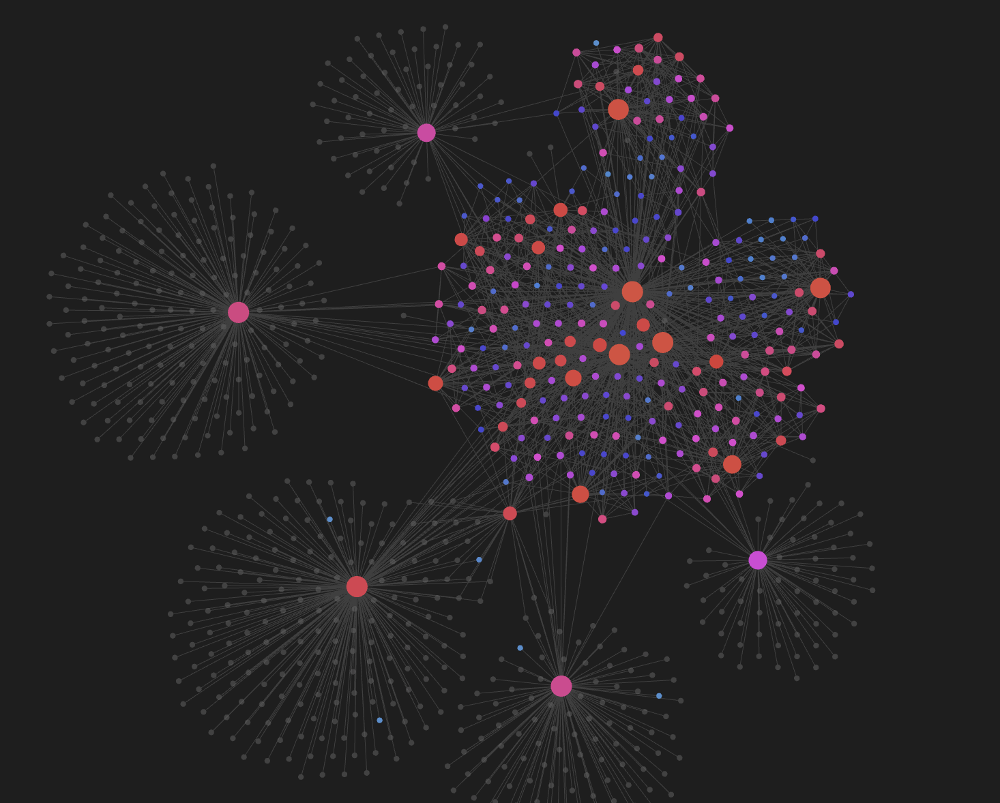
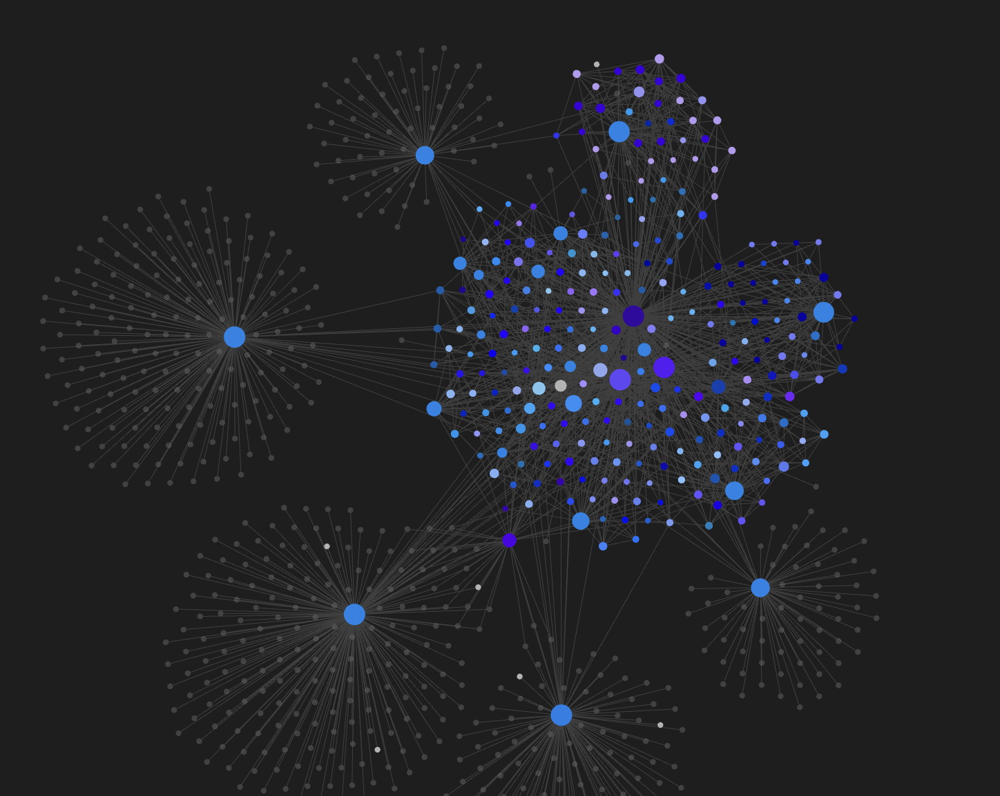

<div align="center">

# 🎨 Auto Tag Graph Colors

**Automatic, intelligent color groups for the Obsidian graph view.**
Zero configuration. Instant results. Beautifully organised.

*A side project by [**Meetzy Corp FZCO**](https://meetzy.ai) — powered & built by the Meetzy team.*

</div>

---

## ✨ What it does

Obsidian's built-in **graph view** lets you assign color groups to your tags — one at a time, by hand, forever. That's fine for 3 tags. It's unusable for 89.

**Auto Tag Graph Colors** solves this in one click:

1. Scans every tag in your vault
2. Assigns each tag a **stable, distinct color** from the palette of your choice
3. Paints the graph view — in real time as you edit notes
4. Keeps everything in sync as tags come and go

Your knowledge graph becomes a color-coded map of your thinking, automatically.

---

## 📸 See it in action

### Normal mode — one color per tag

<div align="center">
  
</div>

Every tag is assigned a distinct, stable color from the selected palette. A rainbow map of your entire knowledge base at a glance.

---

### 🔥 Heat mode — color by connections

<div align="center">
  
</div>

Nodes fade from **cold** (few links) to **hot** (many links) through a smooth **blue → purple → red** HSL gradient — never through muddy green. Percentile ranking means outliers don't crush the scale: your hubs pop, your peripheral notes stay legible.

---

### 🎨 Monochrome mode — one aesthetic, endless nuance

<div align="center">
  
</div>

Pick a base color and every note becomes a shade of it. Different tag combinations still get distinct, deterministic variations (lightness · saturation · subtle ±30° hue drift), so nothing looks flat — but everything looks *yours*.

---

## 🎯 Key features

### 🎨 Six color palettes
`Modern` · `Pastel` · `High Contrast` · `Dark Mode Optimised` · `Colorblind-Friendly (Wong 2011)` · `HSL Generated (golden-angle)`

### 🧠 Three color modes
| Mode | Behaviour |
|------|-----------|
| **Primary** | The first tag in the note wins the color |
| **Priority** | You define an ordered list; first match wins |
| **Multi**   | Falls back to Primary (Obsidian graph limitation) |

### 🌈 Smart Tag Blending
Each note gets its **own** color, blended from its full tag set:
- Base = primary tag color
- Subtly shifted toward the average hue of secondary tags
- Deterministic lightness/saturation variation per unique tag combo
- Notes sharing identical tag sets get identical colors

### 🎨 Monochrome sub-mode
Force every note to a variation of a single chosen color. Different tag combos still get distinct shades — perfect for a clean, cohesive aesthetic (e.g. an all-blue vault).

### 🔥 Heat coloring by connections
Percentile-ranked, HSL-interpolated, and outlier-resistant. See screenshot above.

### 🏷️ Legend overlay
A collapsible legend in every graph view pane, sorted by tag frequency, with a native color picker per tag. Fully mode-aware — the swatches show exactly what the graph shows.

### 🔒 Locks, priorities, exclusions
- Lock a color so it's never auto-regenerated
- Prioritise tags for the "Priority" mode
- Exclude tags that appear everywhere (`#meetzy`, `#daily`, `#template`…)

### ⚡ Real-time everything
Add a tag, remove a tag, rename a note — the graph updates itself. Change a palette in settings, the graph repaints instantly. No "Apply" button anywhere.

### 🧹 Clean uninstall
Disable the plugin and every color group it created is automatically removed. Your manually-added groups are preserved.

---

## ⌨️ Commands

| Command | What it does |
|---|---|
| **Scan vault and apply tag colors** | Rescans the vault and re-applies all colors |
| **Regenerate all tag colors** | Wipes and regenerates every unlocked color |
| **Toggle tag color legend** | Shows or hides the floating legend |
| **Log graph info to console** | Prints internal state to DevTools (for support) |

All commands are available from the command palette. You can bind any of them to a hotkey in **Settings → Hotkeys** (search for *"Auto Tag Graph Colors"*).

---

## 📦 Installation

### From source

```bash
git clone https://github.com/Trisko06/auto-tag-graph-colors.git
cd auto-tag-graph-colors
npm install
npm run build
```

Then copy `main.js`, `manifest.json` and `styles.css` into:

```
<your-vault>/.obsidian/plugins/auto-tag-graph-colors/
```

Reload Obsidian → **Community Plugins** → enable *Auto Tag Graph Colors*.

### Community Plugin store
*(Pending review — see the GitHub releases page in the meantime.)*

---

## 🚀 Quick start

1. Enable the plugin
2. Open **Settings → Auto Tag Graph Colors**
3. Pick a **palette** you like
4. Click **"Scan vault now"** — done ✨
5. Open the **graph view** — every tag is colored

That's the whole workflow. The rest is fine-tuning.

---

## 🛠️ Troubleshooting

**Nodes stay grey after enabling.**
Open the graph view while running "Scan vault now" — the plugin needs a live graph view to inject colors into.

**A tag colors everything the same.**
That tag is probably present in almost every note. Add it to **Excluded tags** in the settings.

**Heat coloring looks flat.**
Percentile mode is on by default. If one node is *way* more connected than the rest, that's expected — percentile spread is proportional to the number of *distinct* connection counts.

**The color picker in the legend closes when I click it.**
Fixed in v1.0.x — make sure you're on the latest build.

Still stuck? Run **"Log graph info to console"** from the command palette, open DevTools (`⌘⌥I`), and share the output.

---

## 🏢 About Meetzy

<div align="center">

### **Turn leads into clients. Powered by AI.**

**[meetzy.ai](https://meetzy.ai)** · [Try it free](https://meetzy.me/apply) · [Book a call](https://calendly.com/cassiustristan/meetzy-discovery-call)

</div>

**Meetzy** is the AI-native operating system for small businesses that want their marketing to actually turn into revenue.

We built it because founders and small teams don't need another disconnected tool — they need **one clear flow** from first touch to closed deal:

| | |
|---|---|
| 🎯 **Marketing OS** | AI-powered social media, email campaigns, audience targeting — content that attracts qualified leads on autopilot |
| 💼 **Sales OS & CRM** | Unified pipeline, deal tracking, AI-guided follow-ups, forecasting — every lead moves toward closing |
| 🎨 **AI Content Studio** | Generate images, videos, webpages, presentations — instantly, on-brand |
| ⚙️ **Workflow Automation** | One logic layer connecting marketing, content, and sales. Everything talks to everything |
| 🤖 **John — Your AI Sales Employee** | Autonomous prospecting, qualification, follow-up, and closing — with messages that actually feel human |

**Save up to 92% vs. traditional stacks.** Starting at **€29/month.**

> *"Meetzy helped me finally connect content, social media, and follow-ups in one place. Instead of juggling tools, I now have a clear flow from posting to conversations."* — Amine B.

> *"Before, some leads just slipped through. Now it's clearer who we should reach out to and when. It gives structure without feeling like a complicated CRM."* — Cyril C.

We build tools for teams who want to move fast, stay lean, and grow without adding chaos. This Obsidian plugin is a small gift back to the knowledge-worker community that inspires everything we do.

**Curious?** → [meetzy.ai](https://meetzy.ai)

---

## 🤝 Contributing

Issues, feature requests, and PRs are welcome. Please open an issue first for larger changes so we can discuss the approach.

---

## 📄 License

MIT © [Meetzy Corp FZCO](https://meetzy.ai)

<div align="center">

Made with ❤️ by the [Meetzy](https://meetzy.ai) team · Dubai, UAE

</div>
